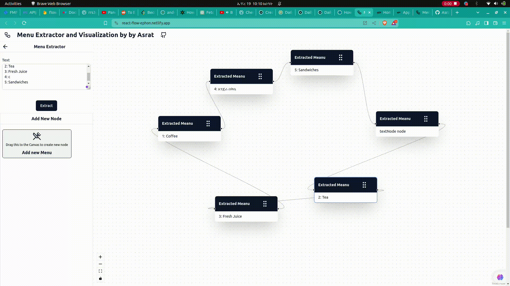

# Menu Extractor and Visualization by by Asrat


An implementation of a node based Menu Extractor using react flow


## Installation

To get started with this application, you will need to follow these steps:

1. Clone the repository: `git clone https://github.com/Asrat001/reactflow-menu-extraction`
2. Install dependencies: `npm install`
3. Start the development server: `npm run dev`
4. Open the application in your browser at http://localhost:5173

## Usage

The application allows users to create flow diagrams from a meanu text . The user can create multiple nodes and connect them with edges. Each node can be customized with a label.

## Directory Structure

```
├── public
├── src
│   ├── assets
│   ├── components
│   │   ├── nodes
│   │   ├── panels
│   │   └── ui
│   │   └── index.ts
│   ├── config
│   │   ├── site.ts
│   │   └── store.ts
│   ├── lib
│   │   └── utils.ts
│   ├── styles
│   ├── App.tsx
```

## Terminology

You can read about the terminology [here](https://reactflow.dev/docs/concepts/terms-and-definitions/) but here is a quick summary:

- **Node**: A node is a single element in the flow diagram. It can be connected to other nodes with edges.
- **Edge**: An edge is a connection between two nodes. It can be used to connect two nodes together.
- **Graph**: A graph is a collection of nodes and edges. A graph can have multiple nodes and edges.
- **Panel**: A panel is a component that is used to change the settings of a node or add a new node to the graph.

## Features

Some of the key features of the application include:

- Creating multiple Nodes.
- Creating Edges between Nodes.
- Creating Nodes from a list of available options.
- Change the settings of a Node.
- Validating Graph Integrity.
- Offline Functionality with PWA.


## Styling

The application uses [Tailwind CSS](https://tailwindcss.com/) for styling.

## Add a new Node

Currently, the application only supports a single type of Node (Text). To add a new Node, you will need to follow these steps:

1. Create a new file in the `src/components/nodes` directory for a new type of node.
2. Create a new file in the `src/components/panel` directory for a new setting panel.
3. Add the new Node to the `nodeTypes` object in the `src/config/site` file.
4. Add the new panel to the `getPanel` function in the `src/components/panel` file.
5. Add the update logic for the new Node in the zustand store in `src/config/store`.

[](https://opensource.org/licenses/MIT)

